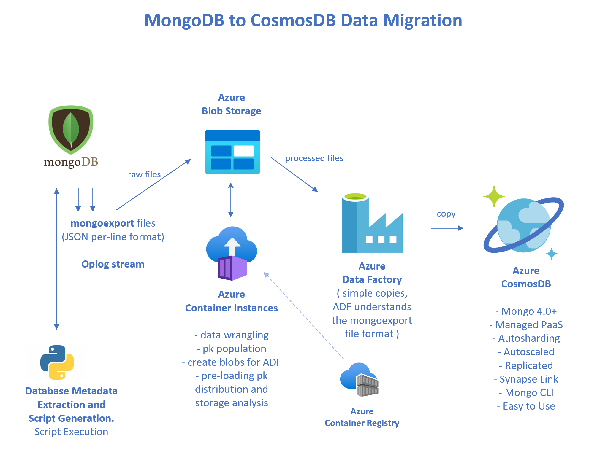

# azure-m2c-wgm

<p align="center"></p>

---

This repo contains:
- The metadata-driven migration process
- A reference implementation of it, including reference databases

Directory map in this repo:

```
├── doc
├── m2c
│   ├── pysrc
│   │   └── __pycache__
│   └── templates
└── reference_app
    ├── artifacts
    ├── data
    │   └── meta
    └── databases
        ├── mongo
        ├── olympics
        │   ├── import_json
        │   └── raw
        ├── openflights
        │   ├── import_json
        │   └── raw
```

## Implementation

The implementation of this process primarily uses **Python3** and the 
**Azure PaaS services** shown in the above diagram.  

The current implementation uses and generates **bash** scripts for linux and macOS
environments.  Windows **powershell** will be added soon.

The **mongoexport** utility, and **file format**, is a core compoment of the migration process.
**Azure Data Factory** understands this file format.

The essence of the process is to **extract source database metadata** as JSON, then
generate the many code, script, and file artifacts from this metadata.  This includes:

- Mongoexport scripts
- Blob Upload scripts
- Azure Container Instance execution scripts (optional)
- Azure Data Factory (ADF) code artifacts - Linked Services, Datasets, Pipelines

The mongoexport files exported from the source database are typically **wrangled**
before being loaded into the target CosmosDB database, via ADF, from blob storage.
The wrangling process can add a **partition key**, sometimes a **doctype**, 
as well as other document modifications.

In some cases the data wrangling can use logic built into the standard python program.
But in other cases that program will need ad-hoc modification per the needs of
the customer and their data.

The data wrangling process can be executed in one of several places:
- On-Prem Datacenter
- In Azure Container Instances, as shown in the above diagram.
- Elsewhere in Azure, such as on a VM.

The output of the wrangling process is blob files in Azure Storage, in mongoexport/mongoimport
format, and suitable for loading into the target CosmosDB database using ADF.

### Oplog

A future version of this migration process will leverage the mongodb **oplog**
in addition to the mongoexport utility program.

---

## The Reference Application

To demonstrate the migration process, and help you understand it, a 
**reference implementation** has been created.

You can optionally execute the migration process vs this data, or
simply observe the output artifacts from it.

### Reference Databases 

Two sample databases have been implemented.  They are:

- **openflights** (airports, airplanes, routes, etc)
- **olympics** (results of the summer and olympic games 1896-2016)

You can load this data into your dev/test database by executing
the following scripts:

```
$ cd reference_app/databases

./mongo_recreate_olympics_db.sh
./mongo_recreate_openflights_db.sh
```

The above scripts use the **mongoimport** program to load a curated set of
datafiles in this repo.  These scripts assume a mongo database running at
localhost:27017; if your dev/test is elsewhere simply modify these two scripts.

### Reference Metadata

The metadata for these two databases has been extracted, and is in this repo
for your reference in the following two files.

```
reference_app/data/meta/olympics_metadata.json
reference_app/data/meta/openflights_metadata.json
```

### Reference Artifacts

Similarly, this repo contains sample code/script/file artifacts that
was generated from this metadata.  See the **reference_app/artifacts/**
directory.
