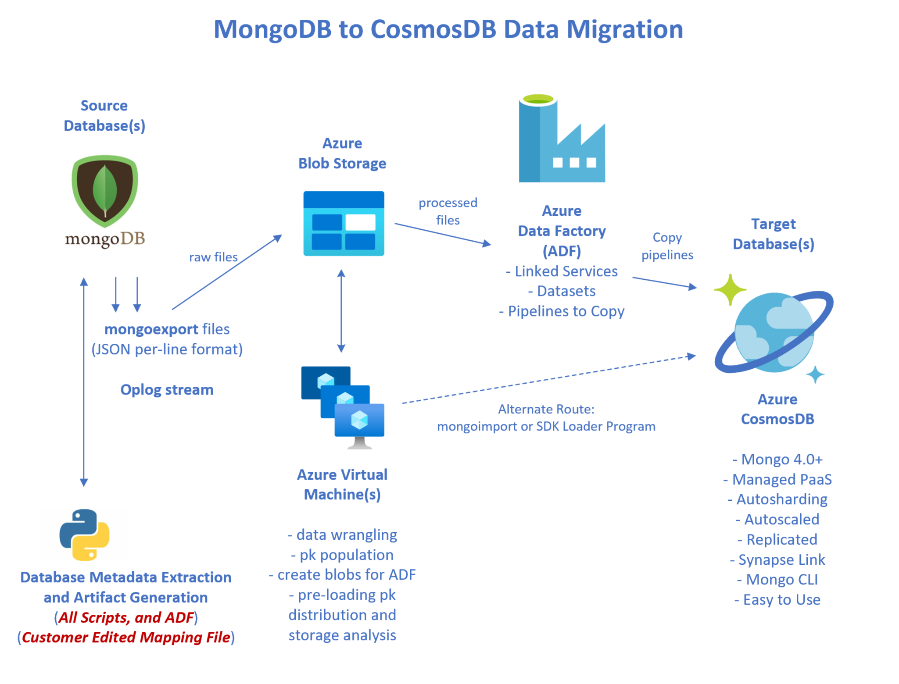

# azure-m2c-wgm

<p align="center"></p>

## High-Level Directory Structure

```
├── docs     <-- Project documentation; start here
├── m2c      <-- the implementation of the Mongo-to-Cosmos (m2c) process
└── uvm      <-- Azure Linux VM setup scripts
```

[Read the Documentation](docs/README.md)

