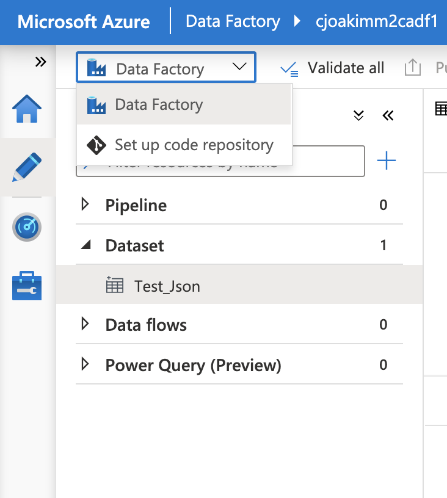
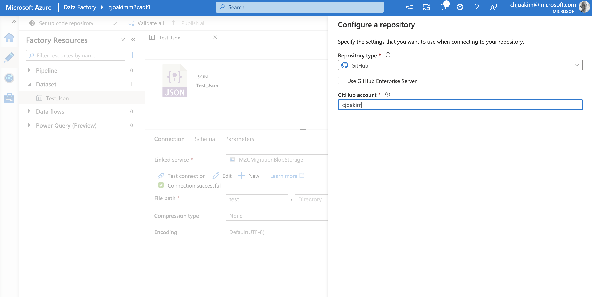
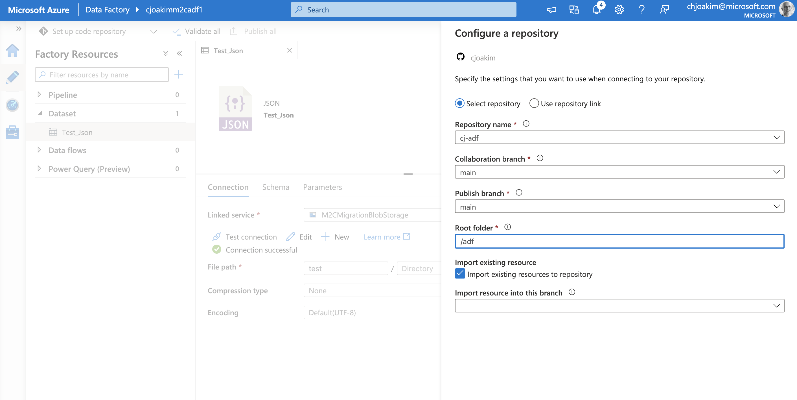
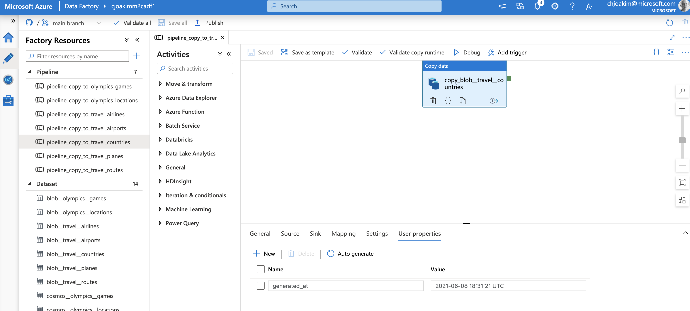

# 15 - ADF Setup with Git Source Control

Please see [Source control in Azure Data Factory](https://docs.microsoft.com/en-us/azure/data-factory/source-control)
to understand how ADF uses git as a source-control system.  

Then configure a git repo of your choice to use with your ADF instance.

## Github Repo Setup

The approach I use is to use a separate private GitHub repo for ADF, and create a directory called **adf/**
within this repo.  Then I tell ADF to use this **adf/** directory as its root repo for artifacts.

For example, the repo structure is this:
```
└── adf
    ├── dataset              <-- put the generated datasets in this directory
    ├── factory
    ├── linkedService        <-- put the generated linked services in this directory
    └── pipeline             <-- put the generated pipelines in this directory
```

The following three screen-shots demonstrate these setup steps:

<p align="center"></p>

---

<p align="center"></p>

---

<p align="center"></p>


## ADF Linked Services

Configure your Linked Services first.

Git add/commit/push only the files in the **linkedService/** directory of your repo.

Then synchonize your ADF with your repo in the ADF Editor web UI.
You'll have to setup the credentials manually in the UI, as the code generator 
intententionally did not embed the credentials.

The click "test connection" to ensure that your LinkedService definition in ADF
is pointing to an actual Azure service.

## ADF Datasets

Next, do a "git pull" in your ADF git repo to ensure that your local repo has
the latest changes.

Then, git add/commit/push only the files in the **dataset/** directory of your repo.

Then again synchonize your ADF with your repo in the ADF Editor web UI.
You may need to click into each dataset, and click  "test connection".


## ADF Pipelines

Again, do a "git pull" in your ADF git repo to ensure that your local repo has
the latest changes.

Then, git add/commit/push only the files in the **pipeline/** directory of your repo.

Your pipelines will look like the following, and contain a single pipeline activity
which copy from the **wrangled adf blob storage container source** to the 
**target cosmosdb collection sink**.  Note that the pipeling also has a **generated_at**
user property, which was created during artifact generation.

<p align="center"></p>

