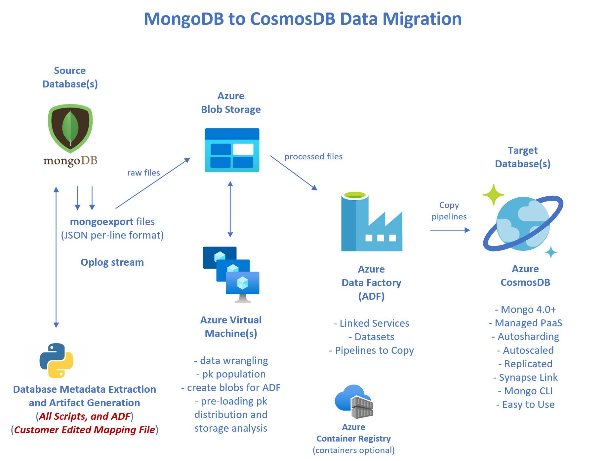

# 16 - Execute Migration

The previous documentation pages 00 through 15 have explained the migration
process, setup various environments, and generated various artifacts.  In this page 
we finally **execute the migration process!**

The architecture diagram is repeated here:

<p align="center"></p>

## mongoexports

In the **artifacts/shell** directory there will be a generated file named
**xxx_mongoexports.sh**, where xxx is the name of one of your source databases.

The contents of these files will look like this:

```
#!/bin/bash

# Bash shell script to export each source collection via mongoexport.
#
# Database Name: openflights
# Generated on:  2021-06-13 13:18:15 UTC
# Template:      mongoexport_script.txt

source env.sh

mkdir -p data/source/mongoexports


echo ''
echo 'mongoexporting - database: openflights container: airlines'
mongoexport --authenticationDatabase admin -u $M2C_SOURCE_MONGODB_USER -p $M2C_SOURCE_MONGODB_PASS --uri mongodb://@localhost:27017 \
    --db openflights \
    --collection airlines \
    --out /Users/cjoakim/github/azure-m2c-wgm-reference-app/reference_app/data/mongoexports/openflights/openflights__airlines.json
     # no --ssl

echo ''
echo 'mongoexporting - database: openflights container: airports'
mongoexport --authenticationDatabase admin -u $M2C_SOURCE_MONGODB_USER -p $M2C_SOURCE_MONGODB_PASS --uri mongodb://@localhost:27017 \
    --db openflights \
    --collection airports \
    --out /Users/cjoakim/github/azure-m2c-wgm-reference-app/reference_app/data/mongoexports/openflights/openflights__airports.json
     # no --ssl

echo ''
echo 'mongoexporting - database: openflights container: countries'
mongoexport --authenticationDatabase admin -u $M2C_SOURCE_MONGODB_USER -p $M2C_SOURCE_MONGODB_PASS --uri mongodb://@localhost:27017 \
    --db openflights \
    --collection countries \
    --out /Users/cjoakim/github/azure-m2c-wgm-reference-app/reference_app/data/mongoexports/openflights/openflights__countries.json
     # no --ssl

echo ''
echo 'mongoexporting - database: openflights container: planes'
mongoexport --authenticationDatabase admin -u $M2C_SOURCE_MONGODB_USER -p $M2C_SOURCE_MONGODB_PASS --uri mongodb://@localhost:27017 \
    --db openflights \
    --collection planes \
    --out /Users/cjoakim/github/azure-m2c-wgm-reference-app/reference_app/data/mongoexports/openflights/openflights__planes.json
     # no --ssl

echo ''
echo 'mongoexporting - database: openflights container: routes'
mongoexport --authenticationDatabase admin -u $M2C_SOURCE_MONGODB_USER -p $M2C_SOURCE_MONGODB_PASS --uri mongodb://@localhost:27017 \
    --db openflights \
    --collection routes \
    --out /Users/cjoakim/github/azure-m2c-wgm-reference-app/reference_app/data/mongoexports/openflights/openflights__routes.json
     # no --ssl

echo 'done'
```

This script will execute the **mongoexport** program for each container in your source database.

It is **recommended** that the mongoexport process executes **close to the source database**,
such as an on-prem VM near your on-prem MongoDB, or a cloud VM near your cloud provider MongoDB.

The way the script is currently implemented the exports are executed sequentially on the same VM.
The project roadmap has a high-ranking item to **parallelize** the mongoexport process; this should
be a very easy enhancement to implement additional scripts for this.

## Uploading the Raw mongoexport blobs to Azure Storage

This step is **intended to be executed from the same location/VM as the previous step, as the mongoexport files are local to that filesystem**.

Section [12 - Create the Azure Storage Containers](12_create_the_azure_storage_containers.md)
described the process to create the necessary storage containers in your Azure Storage account.
These containers are assumed to exist at this point.

Two equivalent sets of mongoexport file upload scripts are created; one uses
**python and Azure Storage SDK** while the other uses the **az CLI**.  Either can
be used depending on your preferences.

Execute one of these generated scripts per source database:

```
olympics_az_cli_mongoexport_uploads.sh
olympics_python_mongoexport_uploads.sh
openflights_az_cli_mongoexport_uploads.sh
openflights_python_mongoexport_uploads.sh
```

The way the script is currently implemented the uploads are executed sequentially on the same VM.
The project roadmap also has a high-ranking item to **parallelize** the uploads process; this should
also be a very easy enhancement to implement additional scripts for this.

## Wrangling for ADF

**This process is expected to be executed on an Azure VM(s) in the same region as your Storage Account.**

The **artifacts/shell** directory will contain a number of generated **wrangle_** scripts;
one per source database, and one for each collection in each source database.

You can execute these all sequentially for a given source database, by executing the **_all.sh**
script.  Likewise, you can execute these scripts individually to parallelize them.

```
reference_app/artifacts/shell/wrangle_openflights_airlines.sh
reference_app/artifacts/shell/wrangle_openflights_airports.sh
reference_app/artifacts/shell/wrangle_openflights_countries.sh
reference_app/artifacts/shell/wrangle_openflights_planes.sh
reference_app/artifacts/shell/wrangle_openflights_routes.sh

reference_app/artifacts/shell/wrangle_openflights_all.sh   <-- executes each of the above
```

Each wrangling file looks like the following.  Please see the generated comment in the 
script that describes the logic.  In short: **download, wrangle, upload, cleanup**.

```
#!/bin/bash

# Bash shell script to wrangle/transform a raw mongoexport file.
#
# Database Name: olympics
# Generated on:  2021-06-13 13:18:14 UTC
# Template:      wrangle_one.txt

source ./env.sh

mkdir -p tmp/olympics/out
mkdir -p out/olympics

# This script does the following:
# 1) Downloads blob olympics__g1896_summer.json from container olympics-raw
#    to local file tmp/olympics/olympics__g1896_summer.json
# 2) Wrangle/transform the downloaded blob, producing local file 
#    tmp/olympics/olympics__g1896_summer__wrangled.json
# 3) Uploads the wrangled file to storage container olympics-adf
# 4) Delete the downloaded and wrangled file, as the host VM may have limited storage
#
# Note: this script is executed by script olympics_wrangle_all.sh

python wrangle.py transform_blob \
    --db olympics \
    --source-coll  g1896_summer \
    --in-container olympics-raw \
    --blobname olympics__g1896_summer.json \
    --filename tmp/olympics/olympics__g1896_summer.json \
    --outfile  tmp/olympics/olympics__g1896_summer__wrangled.json \
    --out-container olympics-games-adf $1 $2 $3 

echo ''
echo 'first line of input file:'
head -1 tmp/olympics/olympics__g1896_summer.json

echo ''
echo 'first line of output file:'
head -1 tmp/olympics/olympics__g1896_summer__wrangled.json

echo 'deleting the downloaded and wrangled files to save disk space...'
rm tmp/olympics/olympics__g1896_summer.json
rm tmp/olympics/olympics__g1896_summer__wrangled.json

echo 'done' 
```

It is important to note that the uploaded wrangled blobs are written to the
Azure Storage container that corresponds to a target CosmosDB database and collection,
and not the source DB and container.  This design allows Azure Data Factory to read 
the one or more transofrmed files in each xxx-adf container as a single **dataset**.


## Execute ADF Pipelines

The last steps of the migration process are to execute each ADF Pipeline.
This can be done either in the Azure Portal and ADF UI, or from a command-line
to execute the generated scripts.

For example, the reference application produces these scripts.

```
adf_pipeline_copy_to_olympics_games.sh
adf_pipeline_copy_to_olympics_locations.sh
adf_pipeline_copy_to_travel_airlines.sh
adf_pipeline_copy_to_travel_airports.sh
adf_pipeline_copy_to_travel_countries.sh
adf_pipeline_copy_to_travel_planes.sh
adf_pipeline_copy_to_travel_routes.sh
```

Execute each script as follows:

```
$ ./adf_pipeline_copy_to_olympics_games.sh

Command group 'datafactory pipeline' is experimental and under development. Reference and support levels: https://aka.ms/CLI_refstatus
{
  "runId": "5abe95e2-cc69-11eb-852f-acde48001122"
}
done
```

Then visit the Monitor tab of your ADF UI, and verify that the Pipeline completes successfully.

TODO - add screen shots here

