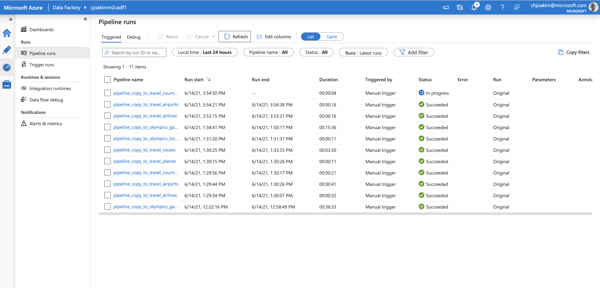
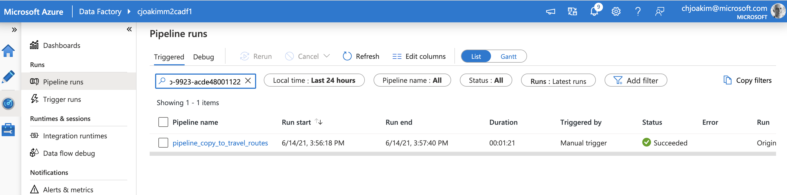
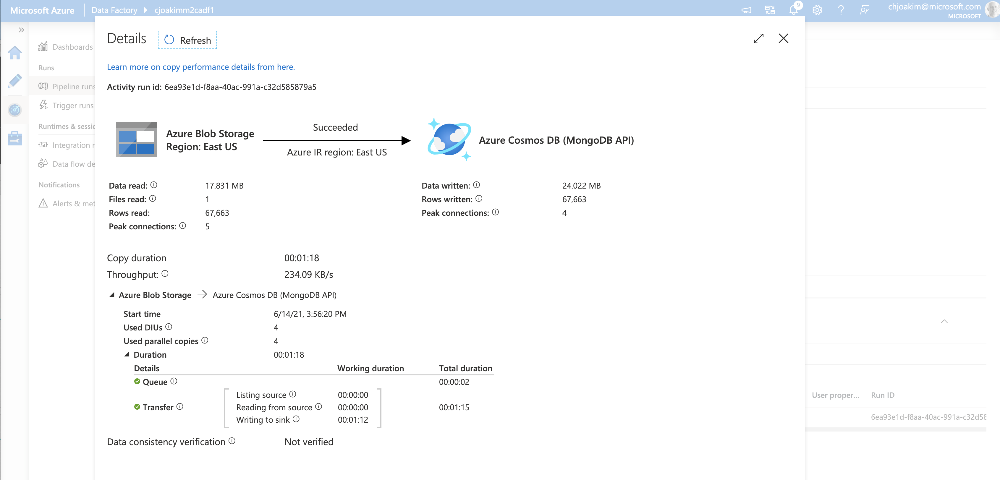
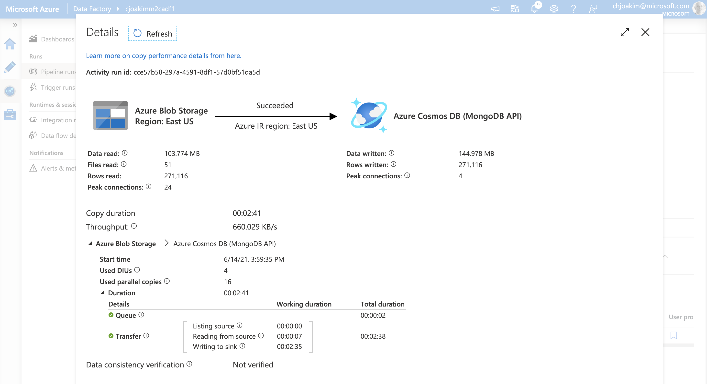

# 16 - Execute Migration

The previous documentation pages 00 through 15 have explained the migration
process, setup various environments, and generated various artifacts.  In this page 
we finally **execute the migration process!**

The architecture diagram is repeated here:

<p align="center"></p>

**These steps are typically executed from an Azure VM, though submitting the ADF pipelines can be done from a Developer laptop.**

---

## mongoexports

In the **artifacts/shell** directory there will be a generated file named
**xxx_mongoexports.sh**, where xxx is the name of one of your source databases.

The contents of these files will look like this:

```
#!/bin/bash

# Bash shell script to export each source collection via mongoexport.
#
# Database Name: openflights
# Generated on:  2021-06-13 13:18:15 UTC
# Template:      mongoexport_script.txt

source env.sh

mkdir -p data/source/mongoexports


echo ''
echo 'mongoexporting - database: openflights container: airlines'
mongoexport --authenticationDatabase admin -u $M2C_SOURCE_MONGODB_USER -p $M2C_SOURCE_MONGODB_PASS --uri mongodb://@localhost:27017 \
    --db openflights \
    --collection airlines \
    --out /Users/cjoakim/github/azure-m2c-wgm-reference-app/reference_app/data/mongoexports/openflights/openflights__airlines.json
     # no --ssl

echo ''
echo 'mongoexporting - database: openflights container: airports'
mongoexport --authenticationDatabase admin -u $M2C_SOURCE_MONGODB_USER -p $M2C_SOURCE_MONGODB_PASS --uri mongodb://@localhost:27017 \
    --db openflights \
    --collection airports \
    --out /Users/cjoakim/github/azure-m2c-wgm-reference-app/reference_app/data/mongoexports/openflights/openflights__airports.json
     # no --ssl

echo ''
echo 'mongoexporting - database: openflights container: countries'
mongoexport --authenticationDatabase admin -u $M2C_SOURCE_MONGODB_USER -p $M2C_SOURCE_MONGODB_PASS --uri mongodb://@localhost:27017 \
    --db openflights \
    --collection countries \
    --out /Users/cjoakim/github/azure-m2c-wgm-reference-app/reference_app/data/mongoexports/openflights/openflights__countries.json
     # no --ssl

echo ''
echo 'mongoexporting - database: openflights container: planes'
mongoexport --authenticationDatabase admin -u $M2C_SOURCE_MONGODB_USER -p $M2C_SOURCE_MONGODB_PASS --uri mongodb://@localhost:27017 \
    --db openflights \
    --collection planes \
    --out /Users/cjoakim/github/azure-m2c-wgm-reference-app/reference_app/data/mongoexports/openflights/openflights__planes.json
     # no --ssl

echo ''
echo 'mongoexporting - database: openflights container: routes'
mongoexport --authenticationDatabase admin -u $M2C_SOURCE_MONGODB_USER -p $M2C_SOURCE_MONGODB_PASS --uri mongodb://@localhost:27017 \
    --db openflights \
    --collection routes \
    --out /Users/cjoakim/github/azure-m2c-wgm-reference-app/reference_app/data/mongoexports/openflights/openflights__routes.json
     # no --ssl

echo 'done'
```

This script will execute the **mongoexport** program for each container in your source database.

It is **recommended** that the mongoexport process executes **close to the source database**,
such as an on-prem VM near your on-prem MongoDB, or a cloud VM near your cloud provider MongoDB.

The way the script is currently implemented the exports are executed sequentially on the same VM.
The project roadmap has a high-ranking item to **parallelize** the mongoexport process; this should
be a very easy enhancement to implement additional scripts for this.

Sample output:

```
$ ./openflights_mongoexports.sh

mongoexporting - database: openflights container: airlines
2021-06-14T11:32:31.520-0400	connected to: mongodb://[**REDACTED**]@localhost:27017
2021-06-14T11:32:31.932-0400	exported 18483 records

mongoexporting - database: openflights container: airports
2021-06-14T11:32:31.967-0400	connected to: mongodb://[**REDACTED**]@localhost:27017
2021-06-14T11:32:32.596-0400	exported 23094 records

mongoexporting - database: openflights container: countries
2021-06-14T11:32:32.633-0400	connected to: mongodb://[**REDACTED**]@localhost:27017
2021-06-14T11:32:32.658-0400	exported 783 records

mongoexporting - database: openflights container: planes
2021-06-14T11:32:32.691-0400	connected to: mongodb://[**REDACTED**]@localhost:27017
2021-06-14T11:32:32.713-0400	exported 738 records

mongoexporting - database: openflights container: routes
2021-06-14T11:32:32.745-0400	connected to: mongodb://[**REDACTED**]@localhost:27017
2021-06-14T11:32:33.749-0400	[####....................]  openflights.routes  40000/202989  (19.7%)
2021-06-14T11:32:34.746-0400	[###########.............]  openflights.routes  96000/202989  (47.3%)
2021-06-14T11:32:35.747-0400	[##################......]  openflights.routes  160000/202989  (78.8%)
2021-06-14T11:32:36.286-0400	[########################]  openflights.routes  202989/202989  (100.0%)
2021-06-14T11:32:36.286-0400	exported 202989 records
done
```

---

## Uploading the Raw mongoexport blobs to Azure Storage

This step is **intended to be executed from the same location/VM as the previous step, as the mongoexport files are local to that filesystem**.

Section [12 - Create the Azure Storage Containers](12_create_the_azure_storage_containers.md)
described the process to create the necessary storage containers in your Azure Storage account.
These containers are assumed to exist at this point.

Two equivalent sets of mongoexport file upload scripts are created; one uses
**python and Azure Storage SDK** while the other uses the **az CLI**.  Either can
be used depending on your preferences.

Execute one of these generated scripts per source database:

```
olympics_az_cli_mongoexport_uploads.sh
olympics_python_mongoexport_uploads.sh
openflights_az_cli_mongoexport_uploads.sh
openflights_python_mongoexport_uploads.sh
```

The way the script is currently implemented the uploads are executed sequentially on the same VM.
The project roadmap also has a high-ranking item to **parallelize** the uploads process; this should
also be a very easy enhancement to implement additional scripts for this.

### storage.py

There is a Python script, in the same directory, for accessing your Azure Storage Account.
The following functions are available:

```
Usage:
    source env.sh ; python storage.py create_blob_container openflights-raw
    source env.sh ; python storage.py create_blob_container openflights-adf
    source env.sh ; python storage.py create_blob_container test
    source env.sh ; python storage.py delete_blob_container openflights-raw
    source env.sh ; python storage.py list_blob_containers
    source env.sh ; python storage.py list_blob_container openflights-raw
    source env.sh ; python storage.py upload_blob local_file_path cname blob_name
    source env.sh ; python storage.py upload_blob requirements.in test requirements.in
    source env.sh ; python storage.py download_blob test aaa.txt aaa-down.txt
```

---

## Wrangling for ADF

**The purpose of these scripts is to transform each raw mongexport file from the source database into the format for loading into CosmosDB via Azure Data Factory**.

**This process is expected to be executed on an Azure VM(s) in the same region as your Storage Account.**

The **artifacts/shell** directory will contain a number of generated **wrangle_** scripts;
one per source database, and one for each collection in each source database.

You can execute these all sequentially for a given source database, by executing the **_all.sh**
script.  Likewise, you can execute these scripts individually to parallelize them.

```
reference_app/artifacts/shell/wrangle_openflights_airlines.sh
reference_app/artifacts/shell/wrangle_openflights_airports.sh
reference_app/artifacts/shell/wrangle_openflights_countries.sh
reference_app/artifacts/shell/wrangle_openflights_planes.sh
reference_app/artifacts/shell/wrangle_openflights_routes.sh

reference_app/artifacts/shell/wrangle_openflights_all.sh   <-- executes each of the above
```

Each wrangling file looks like the following.  Please see the generated comment in the 
script that describes the logic.  In short: **download, wrangle, upload, cleanup**.

```
#!/bin/bash

# Bash shell script to wrangle/transform a raw mongoexport file.
#
# Database Name: olympics
# Generated on:  2021-06-13 13:18:14 UTC
# Template:      wrangle_one.txt

source ./env.sh

mkdir -p tmp/olympics/out
mkdir -p out/olympics

# This script does the following:
# 1) Downloads blob olympics__g1896_summer.json from container olympics-raw
#    to local file tmp/olympics/olympics__g1896_summer.json
# 2) Wrangle/transform the downloaded blob, producing local file 
#    tmp/olympics/olympics__g1896_summer__wrangled.json
# 3) Uploads the wrangled file to storage container olympics-adf
# 4) Delete the downloaded and wrangled file, as the host VM may have limited storage
#
# Note: this script is executed by script olympics_wrangle_all.sh

python wrangle.py transform_blob \
    --db olympics \
    --source-coll  g1896_summer \
    --in-container olympics-raw \
    --blobname olympics__g1896_summer.json \
    --filename tmp/olympics/olympics__g1896_summer.json \
    --outfile  tmp/olympics/olympics__g1896_summer__wrangled.json \
    --out-container olympics-games-adf $1 $2 $3 

echo ''
echo 'first line of input file:'
head -1 tmp/olympics/olympics__g1896_summer.json

echo ''
echo 'first line of output file:'
head -1 tmp/olympics/olympics__g1896_summer__wrangled.json

echo 'deleting the downloaded and wrangled files to save disk space...'
rm tmp/olympics/olympics__g1896_summer.json
rm tmp/olympics/olympics__g1896_summer__wrangled.json

echo 'done' 
```

It is important to note that the uploaded 
**wrangled blobs are written to the Azure Storage container that corresponds to a target CosmosDB database and collection**,
and not the source DB and container.  This design allows Azure Data Factory to read 
the one or more transofrmed files in each xxx-adf container as a single **dataset**.

Output from the above wrangling script:

```
$ ./wrangle_olympics_g1896_summer.sh
$ ./wrangle_olympics_g1896_summer.sh
__main__ args: ['wrangle.py', 'transform_blob', '--db', 'olympics', '--source-coll', 'g1896_summer', '--in-container', 'olympics-raw', '--blobname', 'olympics__g1896_summer.json', '--filename', 'tmp/olympics/olympics__g1896_summer.json', '--outfile', 'tmp/olympics/olympics__g1896_summer__wrangled.json', '--out-container', 'olympics-games-adf']
func: transform_blob
Transformer constructor; parsed args:
  dbname:        olympics
  source_coll:   g1896_summer
  in_container:  olympics-raw
  blobname:      olympics__g1896_summer.json
  filename:      tmp/olympics/olympics__g1896_summer.json
  outfile:       tmp/olympics/olympics__g1896_summer__wrangled.json
  out_container: olympics-games-adf
load_container_mappings; cname: g1896_summer
load_container_mappings; fname: olympics_mapping.json
mappings:
{
  "name": "g1896_summer",
  "mapping": {
    "target_dbname": "olympics",
    "target_container": "games",
    "wrangling_algorithm": "standard",
    "pk_name": "pk",
    "pk_logic": [
      [
        "attribute",
        "games"
      ]
    ],
    "pk_sep": "-",
    "doctype_name": "doctype",
    "doctype_logic": [
      [
        "dynamic",
        "source_cname"
      ]
    ],
    "doctype_sep": "-",
    "additions": [
      [
        "dynamic",
        "some_id",
        "uuid"
      ]
    ],
    "excludes": [
      "id"
    ]
  },
  "source_dbname": "olympics",
  "default_target_dbname": "olympics"
}
StandardDocumentWrangler constructor:
  do_pk_wrangling:      True
  do_doctype_wrangling: True
  do_additions:         True
  do_excludes:          True
wrangling_algorithm: standard
download_blob olympics__g1896_summer.json from olympics-raw to tmp/olympics/olympics__g1896_summer.json
download_blob: olympics-raw olympics__g1896_summer.json -> tmp/olympics/olympics__g1896_summer.json
downloaded tmp/olympics/olympics__g1896_summer.json in 0.4745049476623535ms
transformed 380 lines in 0.025618791580200195
uploading tmp/olympics/olympics__g1896_summer.json at 2021-06-15 17:46:28 UTC to olympics-games-adf/olympics__g1896_summer__wrangled.json
upload_blob: tmp/olympics/olympics__g1896_summer__wrangled.json True -> olympics-games-adf olympics__g1896_summer__wrangled.json
uploaded tmp/olympics/olympics__g1896_summer.json/olympics__g1896_summer__wrangled.json at 2021-06-15 17:46:28 UTC in 0.23813104629516602
{'name': 'olympics__g1896_summer__wrangled.json', 'container': 'olympics-games-adf', 'snapshot': None, 'version_id': None, 'is_current_version': None, 'blob_type': <BlobType.BlockBlob: 'BlockBlob'>, 'metadata': {}, 'encrypted_metadata': None, 'last_modified': datetime.datetime(2021, 6, 15, 17, 46, 29, tzinfo=datetime.timezone.utc), 'etag': '"0x8D9302581416DAE"', 'size': 155348, 'content_range': None, 'append_blob_committed_block_count': None, 'is_append_blob_sealed': None, 'page_blob_sequence_number': None, 'server_encrypted': True, 'copy': {'id': None, 'source': None, 'status': None, 'progress': None, 'completion_time': None, 'status_description': None, 'incremental_copy': None, 'destination_snapshot': None}, 'content_settings': {'content_type': 'application/octet-stream', 'content_encoding': None, 'content_language': None, 'content_md5': bytearray(b"\x93}\'\x13\xe6\x06\x1d\xac\xcc\xfc\r\xac;\x13l\xb3"), 'content_disposition': None, 'cache_control': None}, 'lease': {'status': 'unlocked', 'state': 'available', 'duration': None}, 'blob_tier': 'Hot', 'rehydrate_priority': None, 'blob_tier_change_time': None, 'blob_tier_inferred': True, 'deleted': False, 'deleted_time': None, 'remaining_retention_days': None, 'creation_time': datetime.datetime(2021, 6, 14, 19, 26, 41, tzinfo=datetime.timezone.utc), 'archive_status': None, 'encryption_key_sha256': None, 'encryption_scope': None, 'request_server_encrypted': True, 'object_replication_source_properties': [], 'object_replication_destination_policy': None, 'last_accessed_on': None, 'tag_count': None, 'tags': None}
-
SUMMARY for args:  wrangle.py transform_blob --db olympics --source-coll g1896_summer --in-container olympics-raw --blobname olympics__g1896_summer.json --filename tmp/olympics/olympics__g1896_summer.json --outfile tmp/olympics/olympics__g1896_summer__wrangled.json --out-container olympics-games-adf
  status:          completed
  lines_processed: 380
  start_time:      1623779188.210357
  elapsed_time:    0.7987241744995117

first line of input file:
{"_id":{"$oid":"60c7a7e05480299daf2e2090"},"id":"4113","name":"Anastasios Andreou","sex":"m","age":"-1","height":"-1","weight":"-1","team":"greece","noc":"gre","games":"1896_summer","year":"1896","season":"summer","city":"athina","sport":"athletics","event":"athletics mens 110 metres hurdles","medal":"","medal_value":"0"}

first line of output file:
{"_id":{"$oid":"60c7a7e05480299daf2e2090"},"name":"Anastasios Andreou","sex":"m","age":"-1","height":"-1","weight":"-1","team":"greece","noc":"gre","games":"1896_summer","year":"1896","season":"summer","city":"athina","sport":"athletics","event":"athletics mens 110 metres hurdles","medal":"","medal_value":"0","pk":"1896_summer","doctype":"g1896_summer","some_id":"cec17b83-bf1e-43e1-9ae0-e93e199944af"}
deleting the downloaded and wrangled files to save disk space...
done
```

Items to note:

1) Information about the files being uses, and the mappings applied, are logged. 
2) Information about the uploaded blob is logged.
3) Rows processed and processing elapses time is logged.
4) The first rows of both the input file and the output file are logged for visual verification of the transformation.

---

## Execute ADF Pipelines

The last steps of the migration process are to execute each ADF Pipeline.

This can be done either in the Azure Portal and ADF UI, or from a command-line
to execute the generated scripts.

**The purpose of these ADF Pipelines are to copy the transformed mongoexport files to the containers in your CosmosDB database.**

For example, the reference application produces these scripts.

```
adf_pipeline_copy_to_olympics_games.sh
adf_pipeline_copy_to_olympics_locations.sh
adf_pipeline_copy_to_travel_airlines.sh
adf_pipeline_copy_to_travel_airports.sh
adf_pipeline_copy_to_travel_countries.sh
adf_pipeline_copy_to_travel_planes.sh
adf_pipeline_copy_to_travel_routes.sh
```

Execute each script as follows:

```
$ ./adf_pipeline_copy_to_travel_routes.sh
Command group 'datafactory pipeline' is experimental and under development. Reference and support levels: https://aka.ms/CLI_refstatus
{
  "runId": "9512045e-cd4a-11eb-9923-acde48001122"
}
```

This gives you a **runId** that you can **then monitor in Azure Data Factory**.

Then **visit the Monitor tab of your ADF UI**, and verify that the Pipeline completes successfully.  Scroll to the right of the list of Pipeline Runs to see the **Run ID**
column.  Alternatively, enter the runID value in the search box at the top of the list.

#### ADF Monitor View with list of Pipeline Runs

<p align="center"></p>

---

#### Search for Pipeline by runId

Enter the runId in the search box at the top of the list.

<p align="center"></p>

---

#### A completed Pipeline: travel routes

From the pipeline runs list, click into a Pipeline run to display its details.

<p align="center"></p>

---

#### A completed Pipeline: olympics games

<p align="center"></p>

---

## Validation

At any point in the migration you can execute a **validation process** to confirm that expected Storage Containers, Blobs, and CosmosDB databases and containers are actually present.

For example, before you execute the wrangling scripts you'll want to verify
that the input blobs are present.

Likewise, before you execute the ADF pipelines you'll want to confirm that both the wrangled blobs and the target  CosmosDB databases and collections 
are present.

Here's a list of the available validations and how to execute them:

```
source env.sh ; python validate.py storage_containers
source env.sh ; python validate.py raw_blobs
source env.sh ; python validate.py wrangled_blobs
source env.sh ; python validate.py target_cosmos_db
source env.sh ; python validate.py all    <-- executes all of the above
```

### Sample Output 

```
$ source env.sh ; python validate.py all

validating all ...

validate_storage_containers ...
OK, container present: olympics-games-adf
OK, container present: olympics-locations-adf
OK, container present: olympics-raw
OK, container present: openflights-raw
OK, container present: travel-airlines-adf
OK, container present: travel-airports-adf
OK, container present: travel-countries-adf
OK, container present: travel-planes-adf
OK, container present: travel-routes-adf

validate_raw_blobs ...
OK, blob present; container: olympics-raw blob: olympics__countries.json size: 20365
OK, blob present; container: olympics-raw blob: olympics__g1896_summer.json size: 125037
OK, blob present; container: olympics-raw blob: olympics__g1900_summer.json size: 632359
OK, blob present; container: olympics-raw blob: olympics__g1904_summer.json size: 442391
OK, blob present; container: olympics-raw blob: olympics__g1906_summer.json size: 576820
OK, blob present; container: olympics-raw blob: olympics__g1908_summer.json size: 1024421
OK, blob present; container: olympics-raw blob: olympics__g1912_summer.json size: 1354740
OK, blob present; container: olympics-raw blob: olympics__g1920_summer.json size: 1435359
OK, blob present; container: olympics-raw blob: olympics__g1924_summer.json size: 1709472
OK, blob present; container: olympics-raw blob: olympics__g1924_winter.json size: 154737
OK, blob present; container: olympics-raw blob: olympics__g1928_summer.json size: 1667939
OK, blob present; container: olympics-raw blob: olympics__g1928_winter.json size: 196522
OK, blob present; container: olympics-raw blob: olympics__g1932_summer.json size: 1018258
OK, blob present; container: olympics-raw blob: olympics__g1932_winter.json size: 119721
OK, blob present; container: olympics-raw blob: olympics__g1936_summer.json size: 2136780
OK, blob present; container: olympics-raw blob: olympics__g1936_winter.json size: 310950
OK, blob present; container: olympics-raw blob: olympics__g1948_summer.json size: 2106381
OK, blob present; container: olympics-raw blob: olympics__g1948_winter.json size: 361857
OK, blob present; container: olympics-raw blob: olympics__g1952_summer.json size: 2735307
OK, blob present; container: olympics-raw blob: olympics__g1952_winter.json size: 358855
OK, blob present; container: olympics-raw blob: olympics__g1956_summer.json size: 1713391
OK, blob present; container: olympics-raw blob: olympics__g1956_winter.json size: 449058
OK, blob present; container: olympics-raw blob: olympics__g1960_summer.json size: 2677642
OK, blob present; container: olympics-raw blob: olympics__g1960_winter.json size: 382169
OK, blob present; container: olympics-raw blob: olympics__g1964_summer.json size: 2547116
OK, blob present; container: olympics-raw blob: olympics__g1964_winter.json size: 600251
OK, blob present; container: olympics-raw blob: olympics__g1968_summer.json size: 2900825
OK, blob present; container: olympics-raw blob: olympics__g1968_winter.json size: 638506
OK, blob present; container: olympics-raw blob: olympics__g1972_summer.json size: 3419187
OK, blob present; container: olympics-raw blob: olympics__g1972_winter.json size: 558672
OK, blob present; container: olympics-raw blob: olympics__g1976_summer.json size: 2887176
OK, blob present; container: olympics-raw blob: olympics__g1976_winter.json size: 628892
OK, blob present; container: olympics-raw blob: olympics__g1980_summer.json size: 2380176
OK, blob present; container: olympics-raw blob: olympics__g1980_winter.json size: 594809
OK, blob present; container: olympics-raw blob: olympics__g1984_summer.json size: 3174258
OK, blob present; container: olympics-raw blob: olympics__g1984_winter.json size: 722006
OK, blob present; container: olympics-raw blob: olympics__g1988_summer.json size: 3973001
OK, blob present; container: olympics-raw blob: olympics__g1988_winter.json size: 886867
OK, blob present; container: olympics-raw blob: olympics__g1992_summer.json size: 4328061
OK, blob present; container: olympics-raw blob: olympics__g1992_winter.json size: 1172426
OK, blob present; container: olympics-raw blob: olympics__g1994_winter.json size: 1083239
OK, blob present; container: olympics-raw blob: olympics__g1996_summer.json size: 4567620
OK, blob present; container: olympics-raw blob: olympics__g1998_winter.json size: 1216227
OK, blob present; container: olympics-raw blob: olympics__g2000_summer.json size: 4574295
OK, blob present; container: olympics-raw blob: olympics__g2002_winter.json size: 1417214
OK, blob present; container: olympics-raw blob: olympics__g2004_summer.json size: 4447320
OK, blob present; container: olympics-raw blob: olympics__g2006_winter.json size: 1475181
OK, blob present; container: olympics-raw blob: olympics__g2008_summer.json size: 4511678
OK, blob present; container: olympics-raw blob: olympics__g2010_winter.json size: 1497220
OK, blob present; container: olympics-raw blob: olympics__g2012_summer.json size: 4273943
OK, blob present; container: olympics-raw blob: olympics__g2014_winter.json size: 1639687
OK, blob present; container: olympics-raw blob: olympics__g2016_summer.json size: 4624209
OK, blob present; container: olympics-raw blob: olympics__games.json size: 4309
OK, blob present; container: openflights-raw blob: openflights__airlines.json size: 1140892
OK, blob present; container: openflights-raw blob: openflights__airports.json size: 2691581
OK, blob present; container: openflights-raw blob: openflights__countries.json size: 25621
OK, blob present; container: openflights-raw blob: openflights__planes.json size: 24399
OK, blob present; container: openflights-raw blob: openflights__routes.json size: 16384309

validate_wrangled_blobs ...
OK, blob present; container: olympics-locations-adf blob: olympics__countries__wrangled.json size: 34165
OK, blob present; container: olympics-games-adf blob: olympics__g1896_summer__wrangled.json size: 155348
OK, blob present; container: olympics-games-adf blob: olympics__g1900_summer__wrangled.json size: 786885
OK, blob present; container: olympics-games-adf blob: olympics__g1904_summer__wrangled.json size: 546118
OK, blob present; container: olympics-games-adf blob: olympics__g1906_summer__wrangled.json size: 715085
OK, blob present; container: olympics-games-adf blob: olympics__g1908_summer__wrangled.json size: 1271939
OK, blob present; container: olympics-games-adf blob: olympics__g1912_summer__wrangled.json size: 1677229
OK, blob present; container: olympics-games-adf blob: olympics__g1920_summer__wrangled.json size: 1777915
OK, blob present; container: olympics-games-adf blob: olympics__g1924_summer__wrangled.json size: 2127098
OK, blob present; container: olympics-games-adf blob: olympics__g1924_winter__wrangled.json size: 191436
OK, blob present; container: olympics-games-adf blob: olympics__g1928_summer__wrangled.json size: 2066252
OK, blob present; container: olympics-games-adf blob: olympics__g1928_winter__wrangled.json size: 242969
OK, blob present; container: olympics-games-adf blob: olympics__g1932_summer__wrangled.json size: 1255236
OK, blob present; container: olympics-games-adf blob: olympics__g1932_winter__wrangled.json size: 147802
OK, blob present; container: olympics-games-adf blob: olympics__g1936_summer__wrangled.json size: 2655920
OK, blob present; container: olympics-games-adf blob: olympics__g1936_winter__wrangled.json size: 382359
OK, blob present; container: olympics-games-adf blob: olympics__g1948_summer__wrangled.json size: 2617628
OK, blob present; container: olympics-games-adf blob: olympics__g1948_winter__wrangled.json size: 447683
OK, blob present; container: olympics-games-adf blob: olympics__g1952_summer__wrangled.json size: 3395222
OK, blob present; container: olympics-games-adf blob: olympics__g1952_winter__wrangled.json size: 445705
OK, blob present; container: olympics-games-adf blob: olympics__g1956_summer__wrangled.json size: 2122418
OK, blob present; container: olympics-games-adf blob: olympics__g1956_winter__wrangled.json size: 553392
OK, blob present; container: olympics-games-adf blob: olympics__g1960_summer__wrangled.json size: 3325801
OK, blob present; container: olympics-games-adf blob: olympics__g1960_winter__wrangled.json size: 471215
OK, blob present; container: olympics-games-adf blob: olympics__g1964_summer__wrangled.json size: 3161868
OK, blob present; container: olympics-games-adf blob: olympics__g1964_winter__wrangled.json size: 742111
OK, blob present; container: olympics-games-adf blob: olympics__g1968_summer__wrangled.json size: 3586413
OK, blob present; container: olympics-games-adf blob: olympics__g1968_winter__wrangled.json size: 789426
OK, blob present; container: olympics-games-adf blob: olympics__g1972_summer__wrangled.json size: 4241646
OK, blob present; container: olympics-games-adf blob: olympics__g1972_winter__wrangled.json size: 690712
OK, blob present; container: olympics-games-adf blob: olympics__g1976_summer__wrangled.json size: 3576833
OK, blob present; container: olympics-games-adf blob: olympics__g1976_winter__wrangled.json size: 777372
OK, blob present; container: olympics-games-adf blob: olympics__g1980_summer__wrangled.json size: 2954222
OK, blob present; container: olympics-games-adf blob: olympics__g1980_winter__wrangled.json size: 734144
OK, blob present; container: olympics-games-adf blob: olympics__g1984_summer__wrangled.json size: 3929032
OK, blob present; container: olympics-games-adf blob: olympics__g1984_winter__wrangled.json size: 892267
OK, blob present; container: olympics-games-adf blob: olympics__g1988_summer__wrangled.json size: 4933977
OK, blob present; container: olympics-games-adf blob: olympics__g1988_winter__wrangled.json size: 1097418
OK, blob present; container: olympics-games-adf blob: olympics__g1992_summer__wrangled.json size: 5363845
OK, blob present; container: olympics-games-adf blob: olympics__g1992_winter__wrangled.json size: 1446662
OK, blob present; container: olympics-games-adf blob: olympics__g1994_winter__wrangled.json size: 1335427
OK, blob present; container: olympics-games-adf blob: olympics__g1996_summer__wrangled.json size: 5667496
OK, blob present; container: olympics-games-adf blob: olympics__g1998_winter__wrangled.json size: 1503860
OK, blob present; container: olympics-games-adf blob: olympics__g2000_summer__wrangled.json size: 5677390
OK, blob present; container: olympics-games-adf blob: olympics__g2002_winter__wrangled.json size: 1745080
OK, blob present; container: olympics-games-adf blob: olympics__g2004_summer__wrangled.json size: 5520144
OK, blob present; container: olympics-games-adf blob: olympics__g2006_winter__wrangled.json size: 1824854
OK, blob present; container: olympics-games-adf blob: olympics__g2008_summer__wrangled.json size: 5597199
OK, blob present; container: olympics-games-adf blob: olympics__g2010_winter__wrangled.json size: 1848380
OK, blob present; container: olympics-games-adf blob: olympics__g2012_summer__wrangled.json size: 5305226
OK, blob present; container: olympics-games-adf blob: olympics__g2014_winter__wrangled.json size: 2029927
OK, blob present; container: olympics-games-adf blob: olympics__g2016_summer__wrangled.json size: 5716830
OK, blob present; container: olympics-locations-adf blob: olympics__games__wrangled.json size: 7777
OK, blob present; container: travel-airlines-adf blob: openflights__airlines__wrangled.json size: 1296479
OK, blob present; container: travel-airports-adf blob: openflights__airports__wrangled.json size: 2930510
OK, blob present; container: travel-countries-adf blob: openflights__countries__wrangled.json size: 30345
OK, blob present; container: travel-planes-adf blob: openflights__planes__wrangled.json size: 30899
OK, blob present; container: travel-routes-adf blob: openflights__routes__wrangled.json size: 18697344

validate_target_cosmos_db ...
OK, MongoClient created
OK, collection 'games' is in database 'olympics'
OK, collection 'locations' is in database 'olympics'
OK, collection 'airlines' is in database 'travel'
OK, collection 'airports' is in database 'travel'
OK, collection 'countries' is in database 'travel'
OK, collection 'planes' is in database 'travel'
OK, collection 'routes' is in database 'travel'

```
